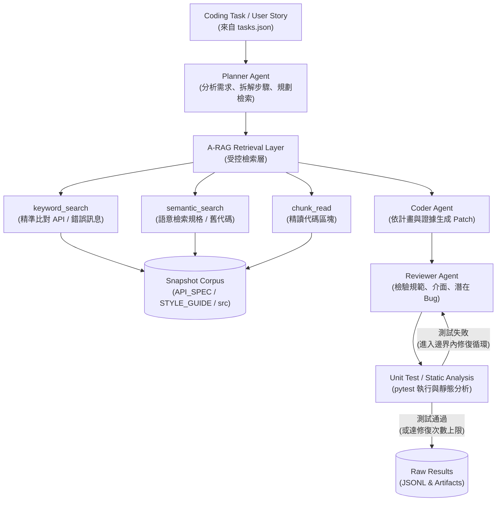

# A-RAG × Autonomous AI Agents 整合實驗專案

[](https://www.python.org/)
[](LICENSE)
[](pyproject.toml)

本專案為 **A-RAG (Agentic Retrieval-Augmented Generation)** 與 **Autonomous AI Agents (Planner–Coder–Reviewer)** 整合的自動程式修復與開發實驗評估平台。旨在針對小型學生成績管理系統（[student_system](student_system/)），透過設計 5 道 Coding Tasks 評估檢索技術對於降低 API 幻覺、提高程式碼測試通過率以及保證專案契約符合度的實際成效。

> [!NOTE]
> 本專案已完整實現 Milestone 1 至 Milestone 7。整合了 OpenAI 相容模型網關、執行沙盒、語意與關鍵字階層式檢索、全域預算熔斷器與盲評模組，並成功跑完正式的雙輪對照實驗（共 90 筆運行數據）。

---

## 1. 核心研究問題 (Research Questions)

本專案圍繞以下四個研究問題進行設計與量化評估：
* **RQ1 (幻覺抑制率)**：A-RAG 是否能降低 coding agent 在函式、模組、參數與專案規範上的幻覺情況（如憑空捏造不存在的 API）？
* **RQ2 (修復成功率)**：A-RAG 是否能提升多 Agent coding system 在需求符合度與測試通過率上的表現？
* **RQ3 (檢索架構對比)**：主動式、階層式的 Agentic retrieval (A-RAG) 是否比傳統固定 top-k 的 Naive RAG 更適合複雜的程式編輯任務？
* **RQ4 (成本與代價)**：整合 A-RAG 後所付出的代價是什麼（例如延遲 Latency、Tool calls 次數與 Token 消耗量）？

---

## 2. 理論定位與文獻支撐 (Literature Mapping)

本實驗架構在理論上由以下六篇關鍵論文共同支撐，形成自底向上的理論融合邏輯：

| 論文 / 文獻來源 | 本專案中的角色與定位 | 是否進入主實作 |
| :--- | :--- | :---: |
| **Attention Is All You Need** | Transformer 與 Self-Attention 機制，為 LLM 的理解能力奠定底層理論基礎 | 否 (理論背景) |
| **Language Models are Unsupervised Multitask Learners (GPT-2)** | 說明 LLM 具備 zero-shot / prompt-based 多任務角色扮演能力，支撐單模型基線 | 否 (理論背景) |
| **TinyLlama** | 小型開源 LLM 代表。提醒我們在受限資源下模型極易因知識匱乏產生幻覺，突顯檢索之重要 | 否 (未來工作) |
| **LoRA Fine-tuning** | 低成本微調與參數效率理論，為未來專案做領域適配 (Domain Adaptation) 提供方向 | 否 (延伸討論) |
| **Autonomous AI Agents for Code Generation** | 提供 Planner–Coder–Reviewer 三階段多代理開發工作流 (Multi-Agent Workflow) | **是 (核心架構)** |
| **A-RAG** | 提供結合 `keyword_search`、`semantic_search` 與 `chunk_read` 的主動階層式檢索層 | **是 (核心架構)** |

### 融合邏輯示意圖
```
[Transformer (理解底座)] ──> [GPT-2 (指令多任務)] ──> [TinyLlama (輕量化挑戰)]
                                                                  │
                                                                  ▼
[A-RAG 階層式檢索層] <── [多 Agent 協同工作流] <── [LoRA (未來適配優化)]
```

---

## 3. 系統架構與流程設計 (System Architecture)

系統主要由 [orchestrator.py](experiments/runner/orchestrator.py) 驅動，結合了 **多代理協同** 與 **A-RAG 檢索層**。以下為整體實驗的端到端執行流程：



---

## 4. 實驗組別與策略設計 (Experimental Strategies)

本專案的實驗設計包含以下三種主要策略（Strategies）：

* **Strategy A (Single LLM Baseline)**：
  無檢索、無多代理的單一模型基準。直接將 Coding Task 丟給模型求解，考驗模型本身的代碼生成能力與內部知識。
* **Strategy C (Multi-Agent workflow without RAG)**：
  採用 Planner–Coder–Reviewer 的三代理協同流程，但不提供任何專案檢索工具，測試純多代理角色扮演分工對代碼質量的提升效果。
* **Strategy E (Multi-Agent workflow with A-RAG)**：
  將 A-RAG 的階層式檢索工具（`keyword_search`、`semantic_search`、`chunk_read`）整合進代理流程。Planner、Coder 與 Reviewer 均可使用 role-bound session 在白名單語料庫中進行主動檢索。

---

## 5. 5 道 Coding Tasks 任務設計

實驗選用 [student_system](student_system/) 作為基準 Codebase，針對以下 5 道具備不同側重點的任務進行生成與修復，詳細定義見 [tasks.json](experiments/tasks.json)：

* **T01: Course Leaderboard (API 使用與排序)**
  * 目標：於 [course.py](student_system/src/course.py) 中新增 `get_course_leaderboard` 函數。
  * 限制：必須使用既有模組 API 獲取成績與學生姓名，禁止直接讀取內部私有字典。
* **T02: Student Transcript Summary (數據聚合與整合)**
  * 目標：於 [student.py](student_system/src/student.py) 中新增 `get_student_transcript_summary`。
  * 限制：計算 GPA 需嚴格符合規格，不得直接信任 stored GPA 值。
* **T03: Honor Roll Students (數據過濾與校正)**
  * 目標：於 [student.py](student_system/src/student.py) 中新增 `get_honor_roll_students`。
  * 限制：需對 `min_average_gpa` 進行邊界與類型驗證，且必須驗證所有課程皆及格。
* **T04: Bulk Score Update Preview (批次驗證與防寫)**
  * 目標：於 [grade.py](student_system/src/grade.py) 中新增 `preview_bulk_score_update`。
  * 限制：不得修改 grade 存儲，必須使用 [utils.py](student_system/src/utils.py) 的驗證函數。
* **T05: Course Pass Stats Refactor (代碼重構與抽象)**
  * 目標：將重複的成績統計邏輯抽象至 [utils.py](student_system/src/utils.py) 的 `summarize_grade_records`，並在 [course.py](student_system/src/course.py) 中複用。
  * 限制：需嚴格遵循 [STYLE_GUIDE.md](student_system/STYLE_GUIDE.md) 指引。

---

## 6. 實驗結果與量化分析 (Experimental Results)

本專案在 `M7` 階段完成了跑滿兩輪完整實驗（共 90 筆運行數據）的平衡子集。詳細數據如下，更詳盡的表格參閱 [M7E28_historical_results_tables.md](論文資料/docs/milestones/M7E28_historical_results_tables.md)：

### 6.1 ACE 策略測試通過率對比 (90 筆平衡口徑)

| 實驗策略 | 記錄數 | Public 測試通過數 | Hidden 測試通過數 | Public 測試通過率 | Hidden 測試通過率 |
| :--- | :---: | :---: | :---: | :---: | :---: |
| **Strategy A** (Single LLM) | 30 | 23 | 22 | 76.7% | 73.3% |
| **Strategy C** (Multi-Agent, No RAG) | 30 | 21 | 21 | 70.0% | 70.0% |
| **Strategy E** (Multi-Agent + A-RAG) | 30 | 27 | 26 | **90.0%** | **86.7%** |

### 6.2 歷史實驗運行統計摘要 (Audit Summary)

| 稽核指標項目 | 統計數值 |
| :--- | :---: |
| 已保存的 `m7e_full` 實驗運行檔案數 | 16 |
| 已保存的總執行記錄數 (Valid Runs) | 223 |
| 基礎設施錯誤數 (Infrastructure Errors) | 0 |
| 累積 Public 測試通過記錄數 | 102 |
| 累積 Hidden 測試通過記錄數 | 123 |
| 累積 Input Tokens 消耗總量 | 3,657,238 |
| 累積 Output Tokens 消耗總量 | 4,029,442 |

### 6.3 失敗與停止型態分析 (Failure Modes)

| 運行中止訊號 | 觸發次數 |
| :--- | :---: |
| 因 `public_pass` (測試通過) 正常停止 | 102 |
| 因 `repair_limit` (修復次數達上限) 停止 | 121 |
| 無任何錯誤正常執行 (`error_type = none`) | 205 |
| 出現未知異常 (`error_type = unknown`) | 18 |
| Patch 套用失敗總和 (Patch Apply Failures) | 103 |
| 僅進行 0 次修復即結束的 Runs | 196 |
| 進行了 1 次修復的 Runs | 27 |

### 6.4 結果討論與發現

> [!TIP]
> **主要結論**：整合了 A-RAG 的多代理架構 (Strategy E) 能有效提供代碼上下文，將 Hidden 測試通過率拉升至 **86.7%**，顯著優於無檢索的 Strategy C。

1. **A-RAG 降低了模型幻覺**：Strategy E 讓代理能在開發前查詢 [API_SPEC.md](student_system/API_SPEC.md)，有效解決了 Strategy A/C 常見的「憑空呼叫不存在的介面或傳入錯誤參數」之幻覺問題。
2. **多代理流程在無檢索時的空轉**：Strategy C (70.0%) 的通過率反而略低於 Strategy A (73.3%)。這表明若不提供專案代碼上下文，多代理角色扮演（Planner-Coder-Reviewer）在反覆修正的循環中，容易在錯誤的假設上空轉，非但沒有提升正確率，反而累積了大量無用的 patch 套用失敗紀錄，增加了 Token 消耗。
3. **Fail-Closed 預算控制的必要性**：歷史運行中曾因單次 Strategy E active run 檢索異常累積 Token，觸發了全域 Token 預算熔斷。這證明了平台設置 [live/budget.py](experiments/live/budget.py) 安全閘門在真實執行中的價值。

---

## 7. 專案目錄結構 (Directory Structure)

```text
A-RAG_Multi-Agent/
├── config.yaml               # 實驗主配置控制檔
├── pyproject.toml            # 專案依賴管理與 Pytest 設定
├── contracts/                # 系統契約規範 (JSON Schema)
│   ├── task.schema.json      # 任務定義格式 Schema
│   ├── result.schema.json    # 實驗結果記錄格式 Schema
│   └── retrieval-log.schema.json # 檢索日誌格式 Schema
├── student_system/           # 實驗受控對象：學生成績管理系統
│   ├── README.md             # 學生系統功能簡介
│   ├── API_SPEC.md           # 學生系統對外 API 規格書
│   ├── STYLE_GUIDE.md        # 學生系統程式碼風格指南
│   ├── ISSUES.md             # Bug 描述與維護任務單
│   ├── src/                  # 學生系統源代碼
│   │   ├── student.py        # 學生模組
│   │   ├── course.py         # 課程模組
│   │   ├── grade.py          # 成績與 GPA 模組
│   │   └── utils.py          # 數值驗證與通用工具
│   └── tests/                # 學生系統測試用例 (Public & Hidden)
├── experiments/              # 實驗平台核心邏輯
│   ├── cli.py                # 實驗平台主控制命令列入口
│   ├── tasks.json            # 5 道 Coding Tasks 的完整 JSON 定義
│   ├── providers/            # OpenAI-compatible Provider 抽象與模型調配
│   ├── retrieval/            # A-RAG 檢索工具鏈實作
│   ├── runtime/              # 程式執行與沙盒隔離機制
│   ├── runner/               # 實驗編排器 (Orchestrator)、調度器與寫入器
│   ├── strategies/           # Strategy A、C、E 的流程代理行為實作
│   └── live/                 # Live 網關安全控制與預算熔斷機制
├── results/                  # 實驗結果輸出目錄
│   ├── raw/                  # 實驗原始 JSONL 運行日誌與產出物
│   └── derived/              # 經由原始日誌衍生的 CSV 數據與 Markdown 摘要
└── 論文資料/                 # 專案論文依據與開發里程碑文檔
    ├── 專案架構與實驗設計.md # 本實驗的詳細架構與實驗方法說明書
    └── docs/milestones/      # M1 - M7 各里程碑的驗收與審計報告
```

---

## 8. 安全防護與沙盒隔離機制 (Security & Isolation)

本平台在設計上將**安全與防洩漏**視為最高準則：
1. **路徑逃逸防護 (Path Escape Guard)**：運行沙盒嚴格阻擋絕對路徑、相對父目錄 `..` 或是 Symlink 逃逸，確保代碼修改僅限於隔離的 workspace 內。
2. **語料檢索黑名單 (Retrieval Denylist)**：A-RAG 的 Corpus 白名單初始化時會主動過濾並阻擋 `.git/`、`evaluation/hidden_tests/` 與 `results/` 等路徑，嚴防隱藏測試樣例與參考答案洩漏給 Agent。
3. **交易式補丁寫入 (Transactional Patching)**：Coder 產生的 Patch 在套用時採取 ACID 交易原則，多檔案修改只要其中一個 hunk 失敗，即自動完全 rollback 恢復 starter snapshot。
4. **預算熔斷控制 (Budget Circuit Breaker)**：全域跟單次 run 均有嚴格的 token 數、API 呼叫次數、牆鐘時間 (wall-clock time) 上限，一旦超支即自動中止，防止資源無限消耗。

---

## 9. 實驗執行指引 (Execution Guide)

### 9.1 環境準備
本專案要求 Python 3.11 以上版本，並安裝相關依賴：
```bash
pip install -e .[dev]
```

### 9.2 運行單元與集成測試
若要驗證平台契約規範以及各項功能邊界是否正常（共有 590+ 項測試通過）：
```bash
python -m pytest
```

### 9.3 執行 Dry-run (調度排程測試)
不發送任何 API 請求，僅規劃實驗排程：
```bash
python experiments/cli.py dry-run --repo-root .
```

### 9.4 執行 Mock-run (虛擬模型生成)
使用系統內置的 Mock Provider 模擬完整 A/C/E 流程，可用來驗證整個實驗調度與寫入管線：
```bash
python experiments/cli.py mock-run --repo-root . --limit 3
```

### 9.5 數據衍生與摘要生成 (Derive Summary)
當實驗原始 `results/raw/<experiment_id>.jsonl` 完成後，使用 derive 命令生成報告所需的 CSV 與 Markdown 摘要表：
```bash
python experiments/cli.py derive \
  --raw-jsonl results/raw/m7e_full_20260612T233702Z.jsonl \
  --csv results/derived/m7e_full_20260612T233702Z.csv \
  --summary results/derived/m7e_full_20260612T233702Z.md \
  --derived-root results/derived \
  --schema contracts/result.schema.json
```
