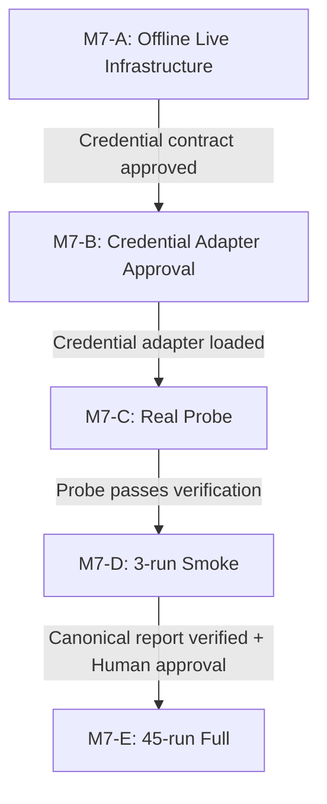

# Milestone 7 Live Provider & Experiment Execution Plan

## 1. Goal Description

This document describes the design and implementation plan for Milestone 7 (M7). M7 connects the existing offline multi-agent evaluation pipeline (developed in M1-M6) to the **Hermes Vertex Gateway** safely. It designs a live OpenAI-compatible HTTP transport layer with strict security constraints, a single-call compatibility probe, a 3-run smoke experiment gate, token budget/circuit-breaking controls, a deterministic scheduler for the full 45-run experiment, a blind manual review process, and the CLI boundaries to execute and audit these phases.

In accordance with M7 constraints, this round creates ONLY the planning and acceptance documents. No implementation code, model calls, network connections, or experiment executions will be performed.

---

## 2. User Review Required

> [!IMPORTANT]
> **Production Gateway Security Controls**
> - **Only HTTPS or explicitly approved localhost Gateway** (where hostname is exactly `localhost`, `127.0.0.1`, or `::1`) is allowed. Any other hostname (like `localhost.example.com`) is rejected.
> - **Proxy Disabled by Default**: Urllib default proxies (like `HTTP_PROXY`, `HTTPS_PROXY`, `ALL_PROXY`, `NO_PROXY`, or system proxy settings) are disabled via `ProxyHandler({})` to prevent proxy credential leaks.
> - **TLS Verification** cannot be disabled under any circumstances.
> - **No redirect handling** will be supported. Redirections are completely blocked.
> - **URL Restrictions**: URL userinfo, fragment segments, and non-approved port allocations are rejected.
> - **Exact Origin Rule**: Host must be fixed at initialization. Before every send, the request origin must match the approved origin exactly.
> - **Response body size limit** will be capped at 10 MB to prevent memory exhaustion.
> - **Late Credential Loading & Isolation**: Credentials will only be loaded at the sending boundary, injected externally from the composition root, and never serialized or printed.

> [!WARNING]
> **Automatic Gates Blocked**
> Even if the automated 3-run smoke gate passes (setting `automated_gate_passed = true`), the pipeline will **never** automatically initiate the full 45-run experiment. An explicit human approval object (`FullRunApproval`) specifying the smoke report hash, smoke experiment ID, full experiment ID, and custom budgets is strictly required.

---

## 3. Open Questions & Blockers Analysis

We have identified the following crucial blockers that must be resolved prior to proceeding with green implementation in M7:

### Blocker 1: Gateway Credential Source is Currently Unknown
- **Impact**: We do not know whether the Hermes Gateway requires standard Vertex OAuth tokens, GCP Service Account keys, ADC, or simple API keys. Assumed logic will fail closed.
- **Resolution Plan**: 
  - `CredentialProvider` must be injected via the live composition root. The transport layer must not search for env variables directly.
  - We do not assume any concrete adapter (e.g., Bearer, Service Account, ADC) as correct. We leave them as abstract placeholders to be individually approved and tested in future rounds.
  - Unit tests will inject a fake `CredentialProvider`. If credential resolution is unresolved, the live probe fails closed.

### Blocker 2: Gateway Token Usage & Request ID Field Integrity
- **Impact**: OpenAI-compatible gateways might omit token usage or request IDs.
- **Resolution Plan**: The compatibility probe checks that the gateway returns complete, non-negative integer token usage and validates request IDs only if the provider's `ProviderCapabilities` declares `supports_request_id=True`.

### Blocker 3: Cost Calculations & Unknown Pricing
- **Impact**: There is no immutable pricing configuration file.
- **Resolution Plan**: 
  - `estimated_cost` must remain `None`. Smoke runs will NOT estimate USD costs. Latency is used only to estimate wall-clock duration.
  - `cost_known: bool` is added to `SmokeGateReport`. Since `cost_known = False`, the automated gate must flag cost as unknown using `risk_flags = ("unknown_cost",)`.
  - Proceeding with unknown cost is an explicit risk that must be human-approved (via `allow_unknown_cost = True` in `FullRunApproval`), not automatically bypassed.

---

## 4. Proposed Changes

All proposed changes are organized by component. Since this round is planning-only, no code will be modified. The planned public interfaces and file updates are outlined below.

```
experiments/
  providers/
    http_transport.py    # [NEW] OpenAI-compatible HTTP transport and credential protocols
    factory.py           # [NEW] Live provider factory wiring up http_transport and configurations
  runner/
    budget.py            # [NEW] Token budget tracker and circuit breakers
    probe.py             # [NEW] Single-call compatibility probe executor
    smoke_scheduler.py   # [NEW] Scheduler for the 3-run smoke runs
    smoke_gate.py        # [NEW] Smoke validation, canonical SmokeGateReport and FullRunApproval
    reviews.py           # [NEW] Three-layer blind review architecture
```

---

### Component: Providers (HTTP Transport & Credentials)

We will introduce a secure, production-grade transport layer to interface with the OpenAI-compatible Gateway. We strictly preserve the existing M5 provider code (`experiments/providers/openai_compatible.py`) and do not modify it.

#### [NEW] [http_transport.py](file:///c:/上課檔案/報告/A-RAG_Multi-Agent/experiments/providers/http_transport.py)
This file implements the `OpenAICompatibleHttpTransport` class. It uses `CredentialProvider` (injected from composition root) to load credentials immediately before sending.

```python
from dataclasses import dataclass
from typing import Protocol, Mapping, Sequence
from experiments.providers.models import TransportRequest, TransportResponse

@dataclass(frozen=True)
class LiveCredential:
    authorization_header: str

class CredentialProvider(Protocol):
    def load_for_send(self) -> LiveCredential:
        """Loads the credential immediately before send. Must not leak secrets."""
        pass

class OpenAICompatibleHttpTransport:
    def __init__(
        self,
        api_base: str,
        credential_provider: CredentialProvider,
        *,
        timeout_seconds: float = 120.0,
        verify_tls: bool = True,
        max_response_bytes: int = 10 * 1024 * 1024, # 10MB limit
    ) -> None:
        self.api_base = api_base
        self.credential_provider = credential_provider
        self.timeout_seconds = timeout_seconds
        self.verify_tls = verify_tls
        self.max_response_bytes = max_response_bytes

    def send(
        self,
        request: TransportRequest,
        *,
        cancellation: object = None,
    ) -> TransportResponse:
        """Sends HTTP request to Gateway. Injects credential from provider at the boundary."""
        # Exact Origin check
        # Block default proxies using ProxyHandler({})
        # Disable redirects
        # Enforce max body size
        # Redact credentials on errors
        pass
```

**Security & Proxy Rules**:
1. **Late Injection**: The transport fetches credentials via `credential_provider.load_for_send()` only within the sending scope. No environment scanning is done inside the transport.
2. **Proxy Disabling**: We disable default environmental proxies using `ProxyHandler({})` within the urllib opener.
3. **Safety Isolation**: Raw credentials are excluded from any dataclass reprs, error outputs, logs, or stored files.
4. **URL and Port checks**: Localhost is allowed only when hostname is exactly `localhost`, `127.0.0.1`, or `::1`. Port specifications must match approved configurations. Fragments and userinfo segments are rejected.

#### [NEW] [factory.py](file:///c:/上課檔案/報告/A-RAG_Multi-Agent/experiments/providers/factory.py)
This factory builds the appropriate provider instances (mock or live) based on the configurations.

```python
from experiments.runner.config import ExperimentConfig
from experiments.providers.openai_compatible import OpenAICompatibleProvider

class LiveProviderFactory:
    @staticmethod
    def create_provider(
        config: ExperimentConfig, 
        model_id: str,
        env: Mapping[str, str]
    ) -> OpenAICompatibleProvider:
        """Creates an OpenAICompatibleProvider wired to OpenAICompatibleHttpTransport when live."""
        pass
```

---

### Component: Budget & Circuit Breaker

#### [NEW] [budget.py](file:///c:/上課檔案/報告/A-RAG_Multi-Agent/experiments/runner/budget.py)
Manages the consumption of tokens and request failures in real-time.

```python
from dataclasses import dataclass

@dataclass(frozen=True)
class BudgetLimits:
    max_total_input_tokens: int
    max_total_output_tokens: int
    max_total_calls: int
    max_infra_failures: int
    max_consecutive_infra_failures: int
    max_gateway_failures: int
    max_wall_clock_seconds: float
    max_total_cost_usd: float | None = None  # Must be None when cost is unknown
    max_run_cost_usd: float | None = None    # Must be None when cost is unknown

class LiveBudgetTracker:
    def __init__(self, limits: BudgetLimits) -> None:
        self.limits = limits
        self.consumed_input_tokens = 0
        self.consumed_output_tokens = 0
        self.total_calls = 0
        self.consecutive_infra_failures = 0
        self.total_infra_failures = 0
        self.gateway_failures = 0
        self.start_time = 0.0

    def record_tokens(self, input_tokens: int, output_tokens: int) -> None:
        """Records tokens. Triggers BudgetExceededError if limits are breached."""
        pass

    def record_failure(self, is_infra: bool, is_gateway: bool) -> None:
        """Records run failures and triggers circuit breaker if limits are exceeded."""
        pass
```

---

### Component: Gateway Probe & Smoke Scheduler

#### [NEW] [probe.py](file:///c:/上課檔案/報告/A-RAG_Multi-Agent/experiments/runner/probe.py)
Performs a single connection verification request. Does not modify the existing M5 provider.

```python
class GatewayProbe:
    def __init__(self, provider: object) -> None:
        self.provider = provider

    def run_probe(self, model: str) -> None:
        """
        Runs a connection probe using exact model matching (or deterministic approved alias map).
        Validates usage counts are non-negative integers.
        Validates request ID only if capabilities declare supports_request_id=True.
        Validates seed only if supports_seed=True.
        Response must not be appended to the official results files.
        """
        pass
```

---

### Component: Smoke Gate

#### [NEW] [smoke_gate.py](file:///c:/上課檔案/報告/A-RAG_Multi-Agent/experiments/runner/smoke_gate.py)
Defines the `SmokeGateReport` and the human-approval token validation structure `FullRunApproval`.

```python
import json
from dataclasses import dataclass
from pathlib import Path

@dataclass(frozen=True)
class SmokeGateReport:
    report_version: str
    generated_at: str
    smoke_experiment_id: str
    model: str
    provider_id: str
    seed: int
    source_jsonl_relative_path: str
    source_jsonl_sha256: str
    artifact_manifest_set_sha256: str
    retrieval_log_set_sha256: str
    attempted_runs: int
    written_runs: int
    valid_runs: int
    infra_failures: int
    schema_valid: bool
    artifacts_valid: bool
    retrieval_logs_valid: bool
    usage_complete: bool
    leakage_free: bool
    resume_verified: bool
    total_input_tokens: int
    total_output_tokens: int
    total_provider_calls: int
    cost_known: bool                  # Must be False currently
    estimated_cost: float | None       # Must be None currently
    automated_gate_passed: bool        # Purely technical status, does not imply human approval
    risk_flags: tuple[str, ...]        # e.g., ("unknown_cost",)
    rejection_reasons: tuple[str, ...] # Reasons for technical failures

    def to_canonical_json(self) -> bytes:
        """Serializes with canonical UTF-8 JSON, sorted keys, compact separators, final LF."""
        data = self.__dict__
        return (json.dumps(data, sort_keys=True, separators=(",", ":")) + "\n").encode("utf-8")

@dataclass(frozen=True)
class FullRunApproval:
    smoke_report_sha256: str
    smoke_experiment_id: str
    full_experiment_id: str
    approved_token_budget_input: int
    approved_token_budget_output: int
    approved_wall_clock_seconds: float
    allow_unknown_cost: bool
```

**Approval & Verification Rules**:
1. **Sha256 Binding**: CLI recalculates the SHA-256 of the physical report bytes and verifies it matches `FullRunApproval.smoke_report_sha256`.
2. **Tamper Rejection**: Any change to the report bytes or mismatched hashes aborts execution.
3. **Revalidation of Smoke Outputs**:
   - `source_jsonl_sha256`: SHA-256 of raw JSONL bytes.
   - `artifact_manifest_set_sha256`: Find smoke run manifests. Sort using normalized relative POSIX paths. Represent each as `{"path":"...","sha256":"..."}`. Join using `LF` (no trailing LF). Compute SHA-256.
   - `retrieval_log_set_sha256`: Canonical set hash of smoke Strategy E retrieval logs. (A/C must have zero logs).
4. **Gating Check**: `allow_unknown_cost` must be `True` when `cost_known` is `False`.
5. **Rejection check**: Reject if any validation fails, or if report lacks `automated_gate_passed=True`.

---

### Component: Blind Manual Review (Three-Layer Architecture)

We replace simple strategy stripping with a strict Three-Layer Blind Review Architecture.

#### [NEW] [reviews.py](file:///c:/上課檔案/報告/A-RAG_Multi-Agent/experiments/runner/reviews.py)
Defines the mapping boundaries.

1. **Reviewer Package**:
   - Contains only: `blind_id`, `task_id`, `task_description`, `expected_behavior`, `forbidden_behaviors`, `starter_context`, `final_submitted_diff` (or final code), and the scoring rubric.
   - Excludes: `strategy`, `run_id`, `artifact_path` (contains run_id), `tool_calls`, `retrieved_tokens`, `retrieval_success`, `provider_call_count`, `prompt/response`, `role data`, `retrieval log`, `latency`, `tokens`, `cost`, `repetition`, `seed`.
2. **Evaluator-only Mapping**:
   - Contains: `blind_id`, `run_id`.
   - Stored in an exclusive-write file (`results/reviews/blind_mapping.jsonl`). Never exposed to reviewers or RAG.
   - Generated using a random, non-reversible permutation mapping.
3. **Review Results**:
   - Contains: `blind_id`, `rubric_scores`, `reviewer_status`, `timestamp`.
   - Excludes strategy labels.
4. **Final Join**:
   - Done in memory when creating derived outputs: `blind_id` -> `run_id` -> `strategy`. Raw results are never modified.

---

## 5. Implementation Gates (M7-A to M7-E)

The milestone execution must follow these strict gates:



- **M7-A：Offline Live Infrastructure**: Code is complete. Fake provider and injected credentials mock tests are passing. Zero Gateway calls.
- **M7-B：Credential Adapter Approval**: Get exact gateway authentication specification. Approve one concrete credential adapter (Bearer, OAuth, Service Account, or NoAuthLocalhost).
- **M7-C：Real Probe**: Run a single live connection probe. Validate compatibility.
- **M7-D：3-run Smoke**: Run the 3-run scheduler plan. Generate `SmokeGateReport`.
- **M7-E：45-run Full**: Load report and `FullRunApproval`. Perform structural audit checks on all output files. Run full 45 runs.

---

## 6. Verification Plan

Verify plan integrity, and run all M1-M6 tests to ensure zero regression.

---

## 7. TDD Implementation Tasks

The task definitions are revised below to incorporate the new constraints:

### Task 1: Live Credential Boundary and Transport Types
- **Files**:
  - `experiments/providers/http_transport.py` [NEW]
  - `tests/providers/test_credentials.py` [NEW]
- **Public Interfaces**: `LiveCredential`, `CredentialProvider`, `OpenAICompatibleHttpTransport`
- **Failing Tests (RED)**:
  - Verify `CredentialProvider.load_for_send()` yields a `LiveCredential` with correct headers.
  - Verify credentials are not searchable or read by the transport from environmental variables directly.
  - Verify Service Account JSON fails closed if passed directly as Bearer values.
- **Minimal Implementation (GREEN)**: Implement the protocols. Fail closed on unresolved keys.
- **Regression Command**: `python -B -m pytest tests/providers/test_credentials.py -v`
- **Completion Definition**: Secrets are fetched only inside the send scope.

---

### Task 2: HTTP Transport with Injected Sender & Exact Origin
- **Files**:
  - `experiments/providers/http_transport.py` [MODIFY]
  - `tests/providers/test_http_transport.py` [NEW]
- **Public Interfaces**: `OpenAICompatibleHttpTransport.send`
- **Failing Tests (RED)**:
  - Test sending a request using injected mock socket.
  - Test TLS validation is strictly enabled.
  - Test that redirections are blocked.
  - Test payload limit exceeds 10MB fails.
  - Verify environmental proxies (HTTP_PROXY, HTTPS_PROXY, etc.) are bypassed.
  - Verify request to different host origin or fragment/userinfo throws before credential load.
- **Minimal Implementation (GREEN)**: Implement using standard `urllib.request` with `ProxyHandler({})` and origin validations.
- **Regression Command**: `python -B -m pytest tests/providers/test_http_transport.py -v`
- **Completion Definition**: Transports conform to HTTPS rules.

---

### Task 3: Gateway Probe & Capabilities
- **Files**:
  - `experiments/runner/probe.py` [NEW]
  - `tests/runner/test_probe.py` [NEW]
- **Public Interfaces**: `GatewayProbe`
- **Failing Tests (RED)**:
  - Verify probe fails if token usage is missing, negative, or inconsistent.
  - Verify request ID check behavior matches declared capabilities.
  - Verify seed checks respect supports_seed.
  - Verify probe response does not pollute raw JSONL result.
- **Minimal Implementation (GREEN)**: Implement `GatewayProbe` logic without altering M5 provider.
- **Regression Command**: `python -B -m pytest tests/runner/test_probe.py -v`
- **Completion Definition**: Gateway compatibility validated against capability flags.

---

### Task 4: Live Provider Factory
- **Files**:
  - `experiments/providers/factory.py` [NEW]
  - `tests/providers/test_factory.py` [NEW]
- **Public Interfaces**: `LiveProviderFactory`
- **Failing Tests (RED)**:
  - Test live provider creation fails closed without `ARAG_RUN_LIVE_GATEWAY=1`.
- **Minimal Implementation (GREEN)**: Implement routing factory.
- **Regression Command**: `python -B -m pytest tests/providers/test_factory.py -v`
- **Completion Definition**: Live provider initializes correctly under safety gates.

---

### Task 5: Budget Tracker and Unknown Cost
- **Files**:
  - `experiments/runner/budget.py` [NEW]
  - `tests/runner/test_budget.py` [NEW]
- **Public Interfaces**: `BudgetLimits`, `LiveBudgetTracker`
- **Failing Tests (RED)**:
  - Test budget checks fail closed when token or failures exceed limit.
  - Verify cost fields must be `None` when cost is unknown.
- **Minimal Implementation (GREEN)**: Implement tracking logic without inventing costs.
- **Regression Command**: `python -B -m pytest tests/runner/test_budget.py -v`
- **Completion Definition**: Circuit breaker shuts down execution when token budgets are reached.

---

### Task 6: Three-Run Smoke Scheduler
- **Files**:
  - `experiments/runner/smoke_scheduler.py` [NEW]
  - `tests/runner/test_smoke_scheduler.py` [NEW]
- **Public Interfaces**: `build_smoke_scheduler_plan()`
- **Failing Tests (RED)**:
  - Test scheduler returns exact T01 x A/C/E.
- **Minimal Implementation (GREEN)**: Build scheduling.
- **Regression Command**: `python -B -m pytest tests/runner/test_smoke_scheduler.py -v`
- **Completion Definition**: Scheduler outputs correct smoke experiment ID.

---

### Task 7: Smoke Gate & Canonical Report
- **Files**:
  - `experiments/runner/smoke_gate.py` [NEW]
  - `tests/runner/test_smoke_gate.py` [NEW]
- **Public Interfaces**: `SmokeGateReport`, `SmokeGateAuditor`
- **Failing Tests (RED)**:
  - Verify `to_canonical_json()` outputs correct UTF-8 byte stream.
  - Verify gate fails automated checks if usage is incomplete.
  - Verify cost unknown triggers `"unknown_cost"` risk flag but does not fail `automated_gate_passed`.
- **Minimal Implementation (GREEN)**: Implement report builder and verification gates.
- **Regression Command**: `python -B -m pytest tests/runner/test_smoke_gate.py -v`
- **Completion Definition**: Reports are generated in a canonical, immutable layout.

---

### Task 8: Full-Run Approval & Revalidation
- **Files**:
  - `experiments/cli.py` [MODIFY]
  - `tests/runner/test_cli_approval.py` [NEW]
- **Public Interfaces**: `FullRunApproval` validation in CLI.
- **Failing Tests (RED)**:
  - Verify CLI live-run rejects execution if report byte is tampered.
  - Verify CLI rejects if JSONL, manifest, or retrieval log are tampered.
  - Verify CLI rejects if any manifest/log is missing, or A/C retrieval log exists.
  - Verify collision checks on full experiment ID.
  - Verify CLI requires explicit `--approved-smoke-report`, `--approved-smoke-sha256`, `--human-approval FULL_RUN`, and token budgets.
- **Minimal Implementation (GREEN)**: Add approval controls and revalidation to the CLI.
- **Regression Command**: `python -B -m pytest tests/runner/test_cli_approval.py -v`
- **Completion Definition**: Multi-run pipeline executes only with verified report signatures.

---

### Task 9: Three-Layer Blind Review Package
- **Files**:
  - `experiments/runner/reviews.py` [NEW]
  - `tests/runner/test_blind_reviews.py` [NEW]
- **Public Interfaces**: `generate_blind_review_package()`, `record_review_score()`
- **Failing Tests (RED)**:
  - Test that the reviewer package lacks all metadata (strategy, run_id, artifact paths, tool calls, logs, repetitions, seeds).
  - Test that the evaluator-only mapping is stored in an exclusive file and does not leak strategy order.
  - Test that duplicate blind IDs or unknown blind IDs are rejected.
- **Minimal Implementation (GREEN)**: Implement the three-layer mapping.
- **Regression Command**: `python -B -m pytest tests/runner/test_blind_reviews.py -v`
- **Completion Definition**: Reviewers can only grade randomized, anonymized packages.

---

### Task 10: Leakage Audit & Provenance Verification
- **Files**:
  - `experiments/runner/audit.py` [NEW]
  - `tests/leakage/test_m7_live_leakage.py` [NEW]
- **Public Interfaces**: `ExperimentAuditor`
- **Failing Tests (RED)**:
  - Verify that credential strings or GCP secret keys never appear in raw output files or logs.
  - Verify that hidden test data or reference patches are not sent to the provider.
- **Minimal Implementation (GREEN)**: Write scanner scripts verifying output files against target blacklist keywords.
- **Regression Command**: `python -B -m pytest tests/leakage/test_m7_live_leakage.py -v`
- **Completion Definition**: Comprehensive scan confirms zero credentials or hidden tests leaked.
