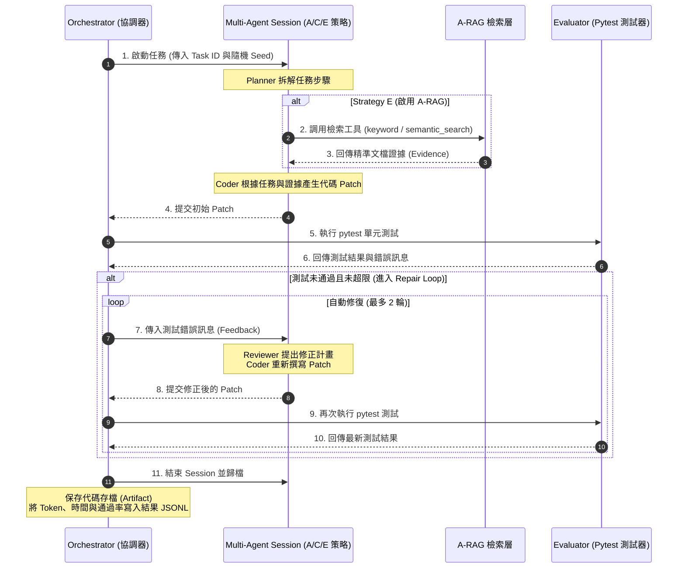

# A-RAG × Autonomous AI Agents 整合實驗：專案架構與設計規範

本文件詳細整理了本專案的**系統架構設計**、**核心運作流程（含 Mermaid 流程圖）**、**五道 Coding 評測任務規格**以及**實驗對照組策略**。旨在協助組員快速理解專案細節，並便於直接整理成 PPT 報告投影片。

---

## 一、 專案核心研究目標

本專案旨在探討：**「將 A-RAG（自主階層式檢索）整合至 Planner-Coder-Reviewer 多 Agent 的開發流程中，是否能有效降低大模型在編寫程式時的『函數呼叫幻覺（即調用不存在的函數）』現象，並提升單元測試通過率與需求符合度。」**

*   **傳統開發的痛點**：單一模型在開發時，容易憑空編寫出專案中根本不存在的函數（稱為「幻覺」）。
*   **多 Agent 的盲區**：在沒有檢索文獻支持的情況下，即便有 Reviewer Agent 指出錯誤，Coder Agent 也只能在盲區中不斷盲目猜測函數名稱，最終陷入死循環並耗盡修復預算。
*   **本專案的解決方案**：透過實作一個小型學生資訊管理系統（`student_system`）作為測試基準，量化評估檢索與多 Agent 協同對消除幻覺的成效。

---

## 二、 六篇論文的理論支撐與深度融合邏輯（PPT 報告必備核心）

雖然本專案的實作（實驗）主要圍繞在 **A-RAG** 與 **Multi-Agent 程式碼開發** 兩篇論文，但**本專案的系統設計在理論與架構上得到了全部六篇論文的支持**。組員在報告時，應以下列的「邏輯遞進鏈」說明這六篇論文的關聯：

```text
Transformer (底層大腦) 
   └── GPT-2 (Prompt 多任務能力，支撐 Single LLM 與 Agent 角色扮演)
          └── TinyLlama (邊緣端小模型實踐，記憶有限，更容易有幻覺，因而急需外掛檢索)
                 └── LoRA (參數微調理論，與 A-RAG 構成「靜態微調 + 動態檢索」的優化路徑)
                        └── AutoDev-Agent (流程調度，提供 Planner-Coder-Reviewer 多 Agent 協作)
                               └── A-RAG (檢索技術，提供三層檢索接口，精準獲取函數定義與節省 Token)
```

### 1. 《Attention Is All You Need》 (Transformer 架構)
*   **在本專案的作用**：提供底層計算與語義理解的**大腦骨幹**。
*   **理論關聯**：不管是 Single LLM (Strategy A) 還是多 Agent (C/E) 中的決策引擎，底層全部都是基於 Transformer 的自注意力機制。模型之所以能理解程式碼邏輯、進行多輪糾錯反思，以及 A-RAG 能進行高維度的語義向量檢索 (Semantic Search)，均由此論文奠定基礎。

### 2. 《Language Models are Unsupervised Multitask Learners》 (GPT-2 論文)
*   **在本專案的作用**：支持多 Agent 的**「角色扮演」**與 **Single LLM 基準線**。
*   **理論關聯**：此論文首次證明語言模型僅需透過 Prompt（文字指令）就能執行多種不同任務（Zero-shot 遷移）。這為我們使用不同的 Prompt 來定義 Planner (規劃者)、Coder (開發者)、Reviewer (審查者) 三個不同 Agent 提供了學術依據，也合理化了 Strategy A 作為基準線的可行性。

### 3. 《TinyLlama: An Open-Source Small Language Model》 (邊緣端小模型)
*   **在本專案的作用**：定義了**「本地部署與資源受限」的現實開發場景**。
*   **理論關聯**：本專案的最終目標是讓自動化開發系統能在工程師的本地端運行。TinyLlama 證明了 1.1B 小模型擁有極高推理效率，但小模型內部的記憶（Parametric Knowledge）相對薄弱，比大模型更容易產生「函數呼叫幻覺」。這使得**引入 A-RAG（外掛知識庫）以輔助本地小模型進行開發，在實務上變得更為迫切且關鍵**。

### 4. 《Efficient Fine-tuning of LoRA Techniques》 (高效參數微調)
*   **在本專案的作用**：為系統領域適配提供**「靜態微調與動態檢索的互補路徑」**。
*   **理論關聯**：雖然實驗不直接進行微調，但 LoRA 提供了如何讓模型熟悉特定專案（如 `student_system`）風格的理論支撐。在系統設計上，LoRA 用於在訓練階段讓模型學習專案的「靜態語法風格與基本學則」（Attention 層給予高 Rank，FFN 給予低 Rank）；而 A-RAG 則在運行階段負責「實時檢索動態更新的 API 數據與 Bug 報告」，兩者互補構成完整的領域適配架構。

### 5. 《Designing Autonomous AI Agents for Code Work》 (AutoDev-Agent)
*   **在本專案的作用**：提供多 Agent 的**「工作流與自動修復 (Repair Loop) 流程」**。
*   **理論關聯**：直接指引了本專案的 **Multi-Agent 運作流程**（Strategy C/E）。透過 Planner、Coder、Reviewer 三個角色的流水線分工，模擬真實軟體團隊的 Agile Sprint 開發與 Code Review 流程，並實現了在 pytest 測試失敗時的自動修正（Repair Loop）。

### 6. 《A-RAG: Scaling Agentic Retrieval-Augmented Generation》 (A-RAG)
*   **在本專案的作用**：提供多 Agent **「動態知識獲取工具與 Token 成本優化」**。
*   **理論關聯**：直接支持了本專案的 **檢索模組**（Strategy E）。A-RAG 賦予 Agent 使用 `keyword_search`、`semantic_search` 和 `chunk_read` 的能力，讓 Agent 在寫代碼時自主調用這些工具來查閱 API 規格，保證寫出的代碼是正確的，同時避免一次性塞入過多 Context 造成的 Token 浪費。

---

## 三、 系統架構設計

### 3.1 專案目錄與模組結構 (Repository Directory Structure)

本專案將主測試系統與實驗調度框架進行了嚴格的模組化解耦，完整的 Repository 結構如下所示：

```text
A-RAG_Multi-Agent/
├── student_system/         # 目標待測系統 (學生資訊管理系統)
│   ├── src/                # 系統核心代碼 (student.py, course.py, grade.py, utils.py)
│   ├── API_SPEC.md         # API 規格說明書 (防幻覺檢索的 Ground Truth)
│   ├── STYLE_GUIDE.md      # 程式碼風格與例外處理指南
│   └── ISSUES.md           # 刻意植入的 Bugs 描述清單 (除錯任務依據)
├── experiments/            # 實驗框架核心
│   ├── cli.py              # 實驗進入點 (執行 CLI 管理指令)
│   ├── tasks.json          # 五道評測任務定義 (T01 ~ T05)
│   ├── providers/          # LLM 提供者轉接器 (Gemini, Claude, OpenAI API 等)
│   ├── retrieval/          # A-RAG 檢索模組 (chunking, keyword, semantic 等)
│   ├── runtime/            # 運行時隔離、安全防護與 Pytest 調度
│   ├── runner/             # 實驗排程、Orchestrator、設定檔載入與失敗分類
│   └── strategies/         # A~E 實驗對照策略具體實作
├── contracts/              # 數據合約 (包含結果 JSONL 格式驗證 Schema)
├── configs/                # 實驗與模型配置 YAML 檔案 (實驗參數管理)
├── results/                # 實驗結果儲存區 (raw/derived 資料分析)
└── workspaces/             # 每次 Run 隔離的獨立暫存工作空間
```

### 3.2 系統架構圖

系統採用分層架構，將多 Agent 協同調度與階層式檢索進行了深度整合：

```mermaid
graph TD
    subgraph 任務輸入 (Input)
        Task[Coding Task: JSON 規格定義]
    end

    subgraph 協同調度層 (Multi-Agent Layer)
        Planner[Planner Agent: 拆解需求與檢索規劃]
        Coder[Coder Agent: 根據計畫與證據編寫 Patch]
        Reviewer[Reviewer Agent: 靜態審查與錯誤反饋]
    end

    subgraph 知識檢索層 (A-RAG Layer)
        ARAG[A-RAG Facade]
        KW[keyword_search: 精確符號匹配]
        SEM[semantic_search: 語意脈絡搜尋]
        CR[chunk_read: 完整段落精讀]
    end

    subgraph 程式庫基礎 (Codebase & Corpus)
        Corpus[(Project Corpus: 函數說明書 / 程式碼規範 / Bug 日誌 / 既有代碼)]
    end

    Task --> Planner
    Planner --> ARAG
    ARAG --> KW
    ARAG --> SEM
    ARAG --> CR
    KW --> Corpus
    SEM --> Corpus
    CR --> Corpus
    ARAG -- 提供檢索證據 (Evidence) --> Coder
    Coder --> Reviewer
```

### 🛠️ 模組細節說明與設計機制（PPT 製作核心素材）

#### 1. A-RAG 檢索層與預算控制機制 (Retrieval & Budget Control)
為防止 Agent 陷入重複查詢或無限檢索的資源消耗黑洞，本系統在 `ARAGMultiAgentStrategySession` (在 `arag_multi_agent.py` 中) 設計了嚴格的檢索預算與快取機制：
*   **檢索工具組**：
    *   `keyword_search`：精確匹配專案內的函數、變數或檔案定義。
    *   `semantic_search`：基於高維度向量相似度，當輸入自然語言需求時檢索語意相近的文件或代碼。
    *   `chunk_read`：以區塊（Chunk）為單位精讀特定檔案內容，避免塞入整份檔案導致 Token 浪費。
*   **角色檢索預算上限 (Retrieval Budgets)**：
    *   **Planner** (規劃階段)：最多 **5 次** 檢索請求。
    *   **Coder** (初始生成階段)：最多 **3 次** 檢索請求。
    *   **Reviewer** (靜態審查階段)：最多 **1 次** 檢索請求。
    *   **Repair Phase** (代碼修復階段)：每一輪最多 **2 次** 檢索請求。
*   **快取防重複機制 (Cache Control)**：
    *   系統內建快取記錄已查詢的參數。在同一個 Role/Phase 中，快取命中重複請求的上限為 **2 次** (`_MAX_CACHE_HITS_PER_ROLE_PHASE = 2`)。
    *   一旦超出此限制，系統將發出提示要求其使用現有證據，或拋出 `RetrievalBudgetExceededError` 終止該次運作，以防 LLM 產生無意義的檢索死循環。

#### 2. 多 Agent 模組提示與格式約束 (Role Prompts & Formatting Constraints)
本系統透過 Prompt 範本對各 Agent 的輸出格式施加了強制的 Schema 約束，確保自動化管線能精準解析：
*   **Planner Agent (`planner.txt`)**：以規劃為核心。限制模型僅輸出單一 JSON 物件，內含 `implementation_steps` (實作步驟)、`risks` (潛在風險) 與 `files_to_modify` (待修改檔案路徑)。**嚴禁輸出任何 Patch 代碼或 Markdown 格式註解**。
*   **Coder Agent (`coder.txt`)**：負責將規劃實體化。嚴格限制僅輸出標準的 **Unified Diff** (不含 ``` 程式碼區塊標記與任何前言/後記說明)。若格式不符，系統將無法自動套用 (Patch Apply Failure)。
*   **Reviewer Agent (`reviewer.txt`)**：強制輸出單一 JSON 物件，且僅允許兩個最上層 Key：
    *   `verdict`：必須為 `"PASS"` 或 `"FAIL"`。
    *   `issues`：當 verdict 為 FAIL 時，填入 1~20 個具體問題描述的字串陣列；若為 PASS 則為空陣列 `[]`。
    *   **嚴禁輸出 thoughts、comments 或代碼修補檔案**。
*   **Repair Agent (`repair.txt`)**：在 Pytest 單元測試未通過時由 Coder 轉變為此角色。限制其必須針對 Reviewer 的回饋產生**最小的修復 Unified Diff**，嚴禁重寫無關的部分或附加任何口語解釋。

---

## 四、 專案核心工作流程

Orchestrator（實驗協調器）驅動的單次解題與自動修復流程如下所示：


### 🔄 工作流詳細執行步驟與機制

1.  **工作啟動 (Job Initialization)**：
    *   `ExperimentOrchestrator` (在 `orchestrator.py` 中) 自任務集中讀取隨機種子 (Seed)、溫度 (Temperature) 與模型名稱。
    *   為當次執行分配唯一的 `run_id` 並建立專案工作空間，若策略包含檢索 (Strategy E)，則初始化 `RetrievalFacade`。
2.  **規劃與檢索 (Planner Step)**：
    *   Planner 閱讀 Coding Task JSON，並利用 `keyword_search` 與 `semantic_search` 獲取關聯證據，制定出實作步驟 JSON。
3.  **初始代碼編寫 (Coder Step)**：
    *   Coder 取得 Planner 的計畫與檢索到的 Evidence 內容，生成初始的 Unified Diff (Patch)。
4.  **靜態審查與單元測試 (Pass@1 Evaluation)**：
    *   Orchestrator 接收 Coder 的 Patch，嘗試將其套用至實際檔案。若套用失敗，會被記錄為 `patch_apply_failures`。
    *   Evaluator 調用 Pytest 執行**公有測試與私有測試**。第一次評估的結果將直接計為 **Pass@1** 指標。
5.  **反饋與修復循環 (Repair Loop)**：
    *   若公有測試失敗，Orchestrator 會捕獲測試的標準輸出與錯誤輸出（stdout/stderr），整理成 `SanitizedPublicFeedback` 回傳給 Coder。
    *   為了**防範測試洩露 (Test Leakage)**，私有測試 (Hidden Tests) 的具體測試腳本與 traceback 報錯細節對 Agent 完全屏蔽。
    *   Coder 進入 `Repair` 狀態進行修正，重複此循環最多 **2 輪**。
7.  **結果歸檔與指標輸出 (Finalization & Metrics)**：
    *   Session 結束時呼叫 `finalize()` 將所有的 Prompt、產出的 Response 以及最終 Patch 封存歸檔。
    *   寫入 JSONL 結果文件，記錄時間延遲 (Latency)、Token 總消耗量、各輪測試通過狀態等，供後續統計分析。

### 🛡️ 4.3 測試執行隔離與安全防護機制 (Secure Test Execution & Path Guards)

為了防範 LLM/Agent 生成具破壞性的惡意代碼，並確保實驗評估的嚴謹性，系統在 `runtime/` 模組中設計了多層安全防護機制：
*   **路徑逃逸防護 (Path Escape Prevention)**：利用 `SecurityGuards.assert_safe_path` 機制，在執行公有與私有單元測試時，會強行檢查測試檔案與被測程式碼的絕對路徑。若偵測到 Agent 試圖使用 `../` 等相對路徑逃出指定工作空間，將立即拋出 `PathEscapeError` 並中止該次執行。
*   **私有測試實體隔離 (Private Test Isolation)**：私有測試用例完全存放於工作空間外部的 `approved_hidden_root` 目錄下。在執行私有測試時，系統會動態加載該外部路徑。此設計確保私有測試檔案不會拷貝到工作空間中，Agent 在任何檢索或讀取模式下均無法讀取到私有測試腳本，徹底杜絕 Test Leakage（測試洩漏）。
*   **測試結果安全過濾與截斷 (Feedback Sanitization)**：
    *   **僅輸出 stdout/stderr/traceback**：Agent 僅能收到公有測試的報錯回饋，且系統會依據任務的 `policy_mapping`（例如 `max_chars = 2048`）進行安全截斷與過濾，防止過長的 traceback 報錯直接耗盡 Coder 的 Context Window。
    *   **無痕私有測試評估**：針對私有測試，系統只輸出成功/失敗的數值統計（Passed/Total），任何 traceback 與詳細報錯皆不會回傳給 Agent，確保模型無法藉由「看錯改錯」的過擬合手段投機通過私有測試。
*   **孤兒處理程序清理 (Orphan Process Cleanup)**：每次呼叫 Pytest 時，都會設立硬性超時限制。一旦逾時，系統會調用 `kill_process_tree` 來遞迴清除測試行程樹（Windows 環境下使用 `taskkill /F /T`），防止未關閉的子進程造成記憶體洩漏與 CPU 佔滿。

---

## 五、 評測任務設計與規格 (T01 ~ T05)

本專案在 `student_system` 中精心設計了 5 道評測題目（詳見 `tasks.json`），用以驗證模型在「嚴格程式碼約束與規範下」是否能消除函數呼叫幻覺與邏輯漏洞：

### 📌 【T01】課程排行榜 (Course Leaderboard)
*   **任務類型**：`api_usage` (困難)
*   **修改檔案**：`student_system/src/course.py` 與 `student_system/src/grade.py`。
*   **任務目標**：在 `course.py` 中實現 `get_course_leaderboard(course_id: str) -> list[dict]`。
*   **設計陷阱與約束**：
    1.  必須先驗證課程是否存在（使用 `get_course_by_id`），若課程不存在須拋出 `ValueError`。
    2.  若課程存在但無學生成績，須返回空列表 `[]`。
    3.  回傳列表必須依「分數降序」排序，若分數相同則依「學生 ID 升序」排序。
    4.  **核心防幻覺點**：回傳的排行榜字典結構必須包含 rank, student_id, name, score, gpa。其中 **gpa 必須即時調用 `grade.score_to_gpa` 計算**，絕對不能直接讀取學生成績紀錄中既存的 `gpa` 屬性（因為 starter 代碼中的 `gpa` 有缺陷），考驗 Coder 是否能通過檢索發現該規則。
    5.  **嚴格禁用**：禁止直接存取模組內的私有原始資料字典 `_COURSES`, `_STUDENTS`, `_GRADES`。
*   **必備 API 符號**：`get_course_by_id`, `grade.get_grades_by_course`, `student.get_student_by_id`, `grade.score_to_gpa`。
*   **檢索關鍵證據**：`student_system/API_SPEC.md`。

### 📌 【T02】學生修課摘要成績單 (Student Transcript Summary)
*   **任務類型**：`api_usage` (困難)
*   **修改檔案**：`student_system/src/student.py` 與 `student_system/src/grade.py`。
*   **任務目標**：在 `student.py` 中實現 `get_student_transcript_summary(student_id: str) -> dict`。
*   **設計陷阱與約束**：
    1.  必須驗證學生是否存在，若不存在拋出 `ValueError`；若該生無成績紀錄，回傳數值欄位為 0 值且 courses 列表為空。
    2.  回傳字典必須包含 `student_id`, `name`, `total_courses`, `total_credits`, `passed_courses`, `pass_rate`, `average_gpa` 以及 courses 列表（按 `course_id` 升序排序）。
    3.  **精度與公式規範**：`pass_rate` 與 `average_gpa` 必須使用 `round(value, 4)` 保留至小數點後四位。且所有 GPA 必須即時調用 `grade.score_to_gpa` 計算，禁止直接取用 database 內的 gpa。
    4.  **嚴格禁用**：禁止直接讀取私有資料字典 `_STUDENTS`, `_COURSES`, `_GRADES`。
*   **必備 API 符號**：`get_student_by_id`, `grade.get_grades_by_student`, `course.get_course_by_id`, `grade.score_to_gpa`。
*   **檢索關鍵證據**：`student_system/API_SPEC.md`、`student_system/STYLE_GUIDE.md`。

### 📌 【T03】榮譽榜學生查詢 (Honor Roll Students)
*   **任務類型**：`code_generation` (困難)
*   **修改檔案**：`student_system/src/student.py` 與 `student_system/src/grade.py`。
*   **任務目標**：在 `student.py` 中實現 `get_honor_roll_students(min_average_gpa: float = 3.0) -> list[dict]`。
*   **設計陷阱與約束**：
    1.  學生入選榮譽榜的資格為：至少修讀一門課、所有修讀科目皆及格（分值 $\ge 60$ ），且平均 GPA 大於等於 `min_average_gpa`。
    2.  **嚴格的邊界校驗**：若輸入的 `min_average_gpa` 包含布林值 (Boolean)，或者為非數值型別，抑或超出 `[0.0, 4.0]` 區間，必須拋出 `ValueError`。
    3.  回傳列表需依平均 GPA 降序，再依學生 ID 升序排序。字典格式需含 `student_id`, `name`, `average_gpa`, `total_courses`。
*   **必備 API 符號**：`get_all_students`, `grade.get_grades_by_student`, `grade.score_to_gpa`。
*   **檢索關鍵證據**：`student_system/API_SPEC.md`、`student_system/STYLE_GUIDE.md`。

### 📌 【T04】批次成績更新預覽 (Bulk Score Update Preview)
*   **任務類型**：`api_usage` (困難)
*   **修改檔案**：`student_system/src/grade.py` 與 `student_system/src/utils.py`。
*   **任務目標**：在 `grade.py` 中實作 `preview_bulk_score_update(updates: list[dict]) -> dict`。
*   **設計陷阱與約束**：
    1.  此函數僅作變更「預覽」，**絕對不可修改 `_GRADES` 儲存空間**。
    2.  必須以獨立驗證處理每一筆更新請求，不得因為中途某筆資料不合規而中斷整個批次任務。
    3.  合法更新包含：`student_id`, `course_id`, `score`, `normalized_score`, `gpa`。
    4.  非法更新包含：`index` (原始索引), `input` (輸入參數), `reason` (失敗原因)。
    5.  驗證時必須依序使用 `student.get_student_by_id`、`course.get_course_by_id` 以及 `utils.validate_score` 來確保資料實體與格式正確。
*   **必備 API 符號**：`student.get_student_by_id`, `course.get_course_by_id`, `utils.validate_score`, `score_to_gpa`。
*   **檢索關鍵證據**：`student_system/API_SPEC.md`、`student_system/STYLE_GUIDE.md`。

### 📌 【T05】成績統計輔助函數重構 (Course Pass Stats Refactor)
*   **任務類型**：`refactoring` (困難)
*   **修改檔案**：`student_system/src/utils.py`、`student_system/src/course.py` 與 `student_system/src/grade.py`。
*   **任務目標**：在 `utils.py` 中定義一個重用的核心計算函式 `summarize_grade_records(records: list[dict]) -> dict`，並在 `course.py` 中新增 `get_course_pass_stats(course_id: str) -> dict` 來引入並重用該計算。
*   **設計陷阱與約束**：
    1.  `summarize_grade_records` 必須具備高度獨立性，只准處理傳入的 list，**禁止依賴或存取外部的私有學生、課程儲存區**。
    2.  統計回傳必須包括 `total_courses`, `passed_courses`, `failed_courses`, `pass_rate`, `average_gpa`（浮點數需 `round(val, 4)`）。
    3.  `get_course_pass_stats` 必須驗證課程後，將課程成績傳入該 Helper 計算，並與 `course_id`, `title`, `credits` 包裝回傳。不得在此函式中重複寫入任何聚合邏輯（DRY 原則）。
    4.  **嚴格防範循環依賴**：注意 utils.py 不得導入 grade.py 或 course.py，以防產生 Python 的 Circular Import 錯誤。
*   **必備 API 符號**：`summarize_grade_records`, `get_course_by_id`, `grade.get_grades_by_course`, `grade.score_to_gpa`。
*   **檢索關鍵證據**：`student_system/STYLE_GUIDE.md`（代碼規範）。

---

## 六、 實驗策略對照組設計 (Strategies)

本實驗共設計了五組對照策略（包含第一版 MVP 的 A、C、E 三組，以及第二版擴展的 B、D 兩組），用以全面評估檢索深度與 Agent 協同對程式生成成效之影響：

| 策略組別 | 運作流程 | 實驗目的與預期問題（PPT 報告重點） |
| :--- | :--- | :--- |
| **Strategy A**<br/>(Single LLM 基準組) | 直接將任務說明交給單一模型，使其生成代碼 Patch。 | **最低基準對照**：無多 Agent 協調，無任何專案脈絡檢索。模型無法得知專案內既存 API 規格與程式風格限制，極度容易編寫出「不存在的函數名稱」（即函數呼叫幻覺）。 |
| **Strategy B**<br/>(Single LLM + Naive RAG) | 系統固定透過簡單語意檢索（Semantic Search）取得 Top-K 段落，作為 context 拼接到 prompt 後丟給單一模型。 | **檢索效果基線**：測試靜態/一次性 RAG 檢索對單一 LLM 的改善效果。容易面臨 Token 浪費（Context Window 膨脹）與無關雜訊干擾，且模型無法自主控制要查詢哪些檔案。 |
| **Strategy C**<br/>(Multi-Agent 協作組) | Planner 規劃 ➡️ Coder 寫代碼 ➡️ Reviewer 審查 ➡️ 測試失敗時自動進入修復循環 (Repair Loop)。 | **流程優化控制**：測試多 Agent 角色分工與自我修復能力。但因為沒有任何文檔檢索，Coder 在修改時只能盲目猜測函數名稱，Reviewer 也缺乏真理依據（Ground Truth），容易陷入死循環直至**修復預算耗盡而宣告失敗**。 |
| **Strategy D**<br/>(Multi-Agent + Naive RAG) | 系統固定檢索 Top-K 文檔放入 context 後，交給多 Agent 團隊協同分析、編寫與修復。 | **多 Agent 與簡易檢索融合**：探討多 Agent 加上一般 RAG 的成效。雖然有角色分工，但因為檢索是靜態的，無法由 Planner 或 Coder 主動作出「階層式精讀（chunk_read）」，可能無法獲取精確的 API 參數細節，效果預期介於 C 與 E 之間。 |
| **Strategy E**<br/>(Multi-Agent + A-RAG) | Planner 規劃 ➡️ **自主調用 A-RAG 進行階層式檢索取得證據** ➡️ Coder 依據證據編寫 Patch ➡️ Reviewer 依證據審查 ➡️ 自動修復。 | **完整整合方案**：多 Agent 配合 A-RAG 自主階層式檢索。Agent 可以精準、按需獲取函數定義與規範。預期能大幅降低 API 幻覺、提高 pytest 通過率並降低 Token 消耗量。 |

---

## 七、 評估指標與工程挑戰

### 📈 評估指標與量化公式

1.  **Pass@1**：
    *   **定義**：模型在不進行任何修復（第 0 輪）的情況下，所生成的初始 Patch 直接通過全部公有與私有單元測試的比例。
2.  **最終通過率 (Final Pass)**：
    *   **定義**：允許最多 2 輪自動修復 (Repair Loop) 後，最終能夠順利通過全部單元測試的比例。
3.  **函數使用正確率 (API Correctness)**：
    $$\text{API Correctness} = \frac{\text{正確調用的既有 API 數}}{\text{代碼中總 API 調用數}}$$
    *   衡量模型是否遵守 `API_SPEC.md` 的規範，沒有發生任何參數或函數名稱的調用錯誤。
4.  **函數幻覺率 (Hallucinated API Rate)**：
    $$\text{Hallucinated API Rate} = \frac{\text{幻覺產生的虛構 API 數}}{\text{代碼中總 API 調用數}}$$
    *   量化模型虛構不存在之函式或模組的機率。
5.  **Token 消耗與效率比 (Token Usage & Cost)**：
    *   統計各策略在單次任務中消耗的 Prompt Tokens 與 Completion Tokens，用以評估多 Agent 協同與檢索所帶來的經濟成本。
6.  **執行延遲 (Latency)**：
    *   包含 LLM 生成延遲與 Pytest 測試執行時間，衡量系統的開發效率。

### ⚠️ 實驗防漏與安全設計 (Sanitization & Anti-Leakage)
為了保證評估結果的嚴謹性，本專案在系統層級實作了兩項安全防範設計：
*   **公私有測試隔離**：測試執行器僅將公有測試 (Public Tests) 的 stdout/stderr 作為 Feedback 回傳給 Agent。私有隱藏測試 (Hidden Tests) 的檔案名稱、內容與 traceback 完全對 Agent 屏蔽，防止模型藉由 Overfitting 測試案例來獲取虛高的 Final Pass 分數。
*   **權限防護鎖**：Agent 無法存取測試用例資料庫，A-RAG 知識庫中僅包含 `API_SPEC.md`, `STYLE_GUIDE.md`, `ISSUES.md` 以及 src 內的程式碼，禁止其檢索 `tests/` 下的私有測試代碼。

### ⚠️ 真實工程痛點（PPT 報告加分與深入討論項）
在 PPT 報告或論文撰寫時，組員可以重點剖析以下兩個在實驗中發現的系統級硬傷：
1.  **盲目糾錯預算耗盡 (Blind Repair Bottleneck)**：
    無檢索支援的多 Agent 策略 (Strategy C) 在初次寫錯 API 名稱後，Reviewer 雖能指出 "API does not exist"，但 Coder 因為沒有 Ground Truth 可以參考，編寫代碼時只能漫無目的地不斷盲試與猜測名稱，導致在自動修復循環中迅速耗盡 2 輪的修補額度，說明了**「缺乏外掛知識庫的多 Agent 只是在盲區中空轉」**。
2.  **Patch 套用脆弱性 (Patch Apply Vulnerability)**：
    大模型生成的 Patch 以 Diff 格式輸出。在實際套用時，即使代碼邏輯 100% 正確，如果模型在 Diff 中寫錯了上下文行號、或是漏掉一個空格/縮排，Git/Patch 套用工具便會失敗（被記錄為 `patch_apply_failures`）。這突顯出**自動化軟體工程 (AI Software Engineering) 領域中，模型輸出格式的嚴格性與後端代碼整合工具的健壯度同樣關鍵**。

---

## 八、 student_system 基準代碼庫設計（含刻意缺陷）

### 8.1 測試用資料集（固定 Seed 資料，不可更動）

本專案使用固定的輕量資料集，確保所有策略在完全相同的基準資料下進行測試，杜絕資料差異干擾：

| 實體 | ID | 名稱 / 課程名 | 學分 |
| :--- | :--- | :--- | :---: |
| 學生 | S001 | Alice | — |
| 學生 | S002 | Bob | — |
| 課程 | C001 | Mathematics | 3 |
| 課程 | C002 | Physics | 4 |
| 課程 | C003 | Empty Course（刻意無人修讀） | 2 |

**成績記錄（`_GRADES` 初始值）：**

| student_id | course_id | score | gpa（儲存值，注意：有缺陷！） |
| :--- | :--- | :---: | :---: |
| S001 | C001 | 85 | 3.0 ← **錯誤**，應為 3.5 |
| S001 | C002 | 90 | 4.0 |
| S002 | C001 | 55 | 0.0 |
| S002 | C002 | 72 | 1.5 ← **錯誤**，應為 2.0 |

> ⚠️ 這份資料的 `gpa` 欄位是刻意寫錯的 Starter 值，用以測試模型是否會乖乖從 `API_SPEC.md` 查閱應呼叫 `score_to_gpa` 重新計算，而非直接讀取已存的錯誤 `gpa` 屬性。

---

### 8.2 刻意植入的 Starter 代碼缺陷（Deliberate Bugs）

所有 Starter 缺陷均已在 `ISSUES.md` 中詳細紀錄，作為 Bug Fix 任務的需求依據：

#### Bug #1 ── `score_to_gpa` 映射邏輯缺陷（`grade.py`）

```python
# ❌ Starter 有缺陷的版本（用來迷惑 Coder）
def score_to_gpa(score: int | float) -> float:
    if score >= 90: return 4.0
    if score >= 80: return 3.0   # ← 85-89 應映射 3.5，但被吃掉了
    if score >= 70: return 1.5   # ← 70-74 應映射 2.0，但被寫錯了
    if score >= 60: return 1.0
    return 0.0
    # 無 [0,100] 範圍外的 ValueError 保護
```

**正確的 GPA 映射表（來自 `API_SPEC.md`）：**

| 分數區間 | 正確 GPA | Starter 的 GPA |
| :---: | :---: | :---: |
| 90 – 100 | 4.0 | 4.0 ✓ |
| 85 – 89  | **3.5** | ❌ 3.0 |
| 80 – 84  | 3.0 | 3.0 ✓ |
| 75 – 79  | 2.5 | ❌ 1.5 |
| 70 – 74  | **2.0** | ❌ 1.5 |
| 60 – 69  | 1.0 | 1.0 ✓ |
| < 60     | 0.0 | 0.0 ✓ |
| 範圍外   | raise `ValueError` | ❌ 無保護 |

#### Bug #2 ── `is_valid_score` 邊界缺陷（`utils.py`）

```python
# ❌ Starter 有缺陷的版本
def is_valid_score(score: object) -> bool:
    if score > 0 and score < 100:   # ← 用了嚴格不等號！排除了 0 和 100
        return True                 #   且未過濾布林值 / 字串，會 TypeError 崩潰
    return False
```

模型必須查閱 `ISSUES.md` 才能得知應將嚴格不等號改為 `>= 0` 和 `<= 100`，並在最前面加入 `isinstance` 型態過濾以防崩潰。

#### Bug #3 ── DRY 原則違反（`student.py` & `grade.py`）

```python
# student.py 和 grade.py 中各自硬編碼了相同的邊界驗證邏輯：
if score < 0 or score > 100:
    raise ValueError("Invalid Score")
# T05 任務要求將此段抽取為 utils.validate_score(score) 並統一調用
```

---

## 九、 A-RAG 檢索系統技術實作細節

### 9.1 知識語料庫（Corpus）的建構方式

語料庫包含以下允許被 Agent 存取的文件（Task 對應的白名單，詳見各 `allowed_corpus` 欄位）：

| 文件 | 用途 |
| :--- | :--- |
| `student_system/API_SPEC.md` | 所有函數的規格說明，是防幻覺的核心依據 |
| `student_system/STYLE_GUIDE.md` | 命名規範、Type Hints、例外處理、精度規範 |
| `student_system/ISSUES.md` | Bug 描述與重構需求來源 |
| `student_system/src/student.py` | 學生模組既有代碼 |
| `student_system/src/course.py` | 課程模組既有代碼 |
| `student_system/src/grade.py` | 成績模組既有代碼（含刻意缺陷） |
| `student_system/src/utils.py` | 工具模組既有代碼（含刻意缺陷） |

> 🔒 **安全守衛（Security Guards）**：以下路徑被設為**完全拒絕清單（Denylist）**，Agent 的任何檢索請求都不能存取這些路徑，否則拋出 `DenylistedCorpusError`：
> - `evaluation/hidden_tests/` — 私有測試案例
> - `evaluation/reference_patches/` — 參考解答
> - `results/` — 歷史實驗結果
> - `workspaces/` — 正在執行中的工作空間
> - `.git/` — 版本控制資料
> - 任何包含 `__pycache__`、`.pytest_cache`、`artifact` 等組件的路徑

---

### 9.2 文件分塊策略（Chunking Strategy）

`chunking.py` 根據**文件類型**採用不同的智慧分塊策略，以保留語意完整性：

| 文件類型 | 分塊策略 | 細節 |
| :--- | :--- | :--- |
| `.md` Markdown | 按標題（`#`~`######`）分段 | 每個 `##` 級標題構成一個語義段落，超長段落再按 80 行滑窗切分 |
| `.py` Python | 按頂層函數/類定義分塊 | 使用 `ast.parse` 解析 Python 語法樹，識別 `def`/`class` 邊界後分塊，確保每塊都是語義完整的函數定義 |
| 其他格式 | 固定滑窗分塊 | 最大 **80 行**或 **4,000 字元**，相鄰塊之間保留 **10 行重疊**（Overlap），防止跨塊資訊丟失 |

每個 Chunk 的唯一 ID 格式為：`{file_path}#chunk_{index:04d}_{sha256[:12]}`

---

### 9.3 Keyword Search 評分機制

`keyword.py` 使用**加權規則評分**：

| 命中條件 | 分數加成 |
| :--- | :---: |
| 整個查詢字串在 Chunk **正文**中完整出現 | **+5.0** |
| 整個查詢字串在 Chunk **路徑名**中出現 | **+3.0** |
| 每個查詢詞（token）的比例命中率 | **+2.0 × (matched / total)** |
| 查詢詞在 Chunk 中的出現密度 | **+密度分** |

結果依分數降序排列，取前 `top_k` 個命中 Chunk。

---

### 9.4 Semantic Search（TF-IDF 餘弦相似度）

`semantic.py` 使用**純標準函式庫的 TF-IDF 向量空間模型**，不依賴 any 外部 Embedding API，確保**完全確定性（Deterministic）**與可重現性：

**IDF 公式：**
$$\text{IDF}(t) = \ln\!\left(\frac{1 + N}{1 + df_t}\right) + 1$$

其中 $N$ 為語料庫中的總 Chunk 數，$df_t$ 為包含詞彙 $t$ 的 Chunk 數。

**TF-IDF 向量化：**
$$\text{TF-IDF}(t, d) = \frac{\text{count}(t, d)}{\text{total\_tokens}(d)} \times \text{IDF}(t)$$

**相似度計算（Cosine Similarity）：**
$$\text{score}(q, d) = \frac{\vec{q} \cdot \vec{d}}{|\vec{q}| \times |\vec{d}|}$$

此設計的核心優點：**無需呼叫外部 Embedding API、計算完全確定、允許在離線環境下重現整個實驗**。

---

### 9.5 Evidence 繼承鏈機制（Evidence Ledger Inheritance）

這是 Strategy E 中最核心的設計之一，確保知識在角色之間被有效傳遞而不重複查詢：

```
Planner 檢索到 Evidence E000001, E000002 (keyword_search: "get_course_by_id")
       ↓ [planner_evidence_ids 傳入 Coder]
Coder 在 Prompt 中已可看見 E000001, E000002
Coder 再進行自己的檢索，新增 E000003 (chunk_read: "API_SPEC.md")
       ↓ [coder_evidence_ids 傳入 Reviewer]
Reviewer 在 Prompt 中可看見 E000001, E000002, E000003 的完整知識脈絡
```

每條 Evidence 記錄在 `EvidenceLedger` 中，包含：`evidence_id`、`run_id`、`task_id`、`role`、`phase`、`tool_name`（keyword_search / semantic_search / chunk_read）、`file_path`、`chunk_id`、`text`、`token_count`。

---

## 十、 實驗可重現性與結果記錄設計

### 10.1 實驗控制參數（可配置項目）

所有實驗的核心控制變數均在 `ExperimentConfig` (在 `config.py` 中) 中統一管理，確保各策略之間的公平比較：

| 配置參數 | 型別 | 說明 |
| :--- | :--- | :--- |
| `strategies` | `tuple[str]` | 本次執行的策略組合，如 `("A", "C", "E")` |
| `repetitions` | `int ≥ 1` | 每個 (Task, Strategy) 組合的重複執行次數 |
| `max_repair_rounds` | `int ∈ [0, 2]` | 最大自動修復輪數，上限強制為 **2** |
| `seed` | `int` | 全局隨機種子，確保 LLM 採樣可重現 |
| `agent_timeout_seconds` | `float > 0` | 單次 LLM 呼叫的超時上限 |
| `unit_test_timeout_seconds` | `float > 0` | Pytest 執行的超時上限 |
| `total_run_timeout_seconds` | `float > 0` | 整個 Run（含修復循環）的總超時上限 |
| `model` | `str` | 使用的 LLM 模型 ID |

> ⚠️ **安全強制**：配置檔案中嚴禁出現任何包含 `api_key`、`token`、`secret`、`credential` 等字樣的鍵名，系統會在載入時自動掃描並拋出 `ExperimentConfigError`，防止 API 金鑰意外寫入實驗設定檔。

---

### 10.2 每次 Run 記錄的完整結果欄位（JSONL Schema）

每次 `(Task × Strategy × Repetition)` 的執行結果，均以一行 JSON 寫入結果 JSONL 文件，供後續統計分析使用：

| 欄位名稱 | 類型 | 說明 |
| :--- | :--- | :--- |
| `run_id` | `str` | 唯一執行 ID（含 task_id + strategy + repetition + model + seed） |
| `task_id` | `str` | 任務 ID（T01 ~ T05） |
| `strategy` | `str` | 執行策略（A / C / E） |
| `repetition` | `int` | 第幾次重複（從 1 開始） |
| `model` | `str` | 使用的 LLM 模型名稱 |
| `seed` | `int` | 本次使用的隨機種子 |
| `pass1_public` | `bool` | 第 0 輪（未修復）是否通過公有測試 |
| `pass1_hidden` | `bool` | 第 0 輪是否通過私有測試 |
| `final_public` | `bool` | 最終（允許修復後）是否通過公有測試 |
| `final_hidden` | `bool` | 最終是否通過私有測試 |
| `public_tests_passed` | `int` | 最終通過的公有測試案例數 |
| `public_tests_total` | `int` | 公有測試總數 |
| `hidden_tests_passed` | `int` | 最終通過的私有測試案例數 |
| `repair_rounds` | `int` | 實際進行了幾輪修復 |
| `patch_apply_failures` | `int` | Patch 套用失敗次數 |
| `tool_calls` | `int` | A-RAG 工具調用總次數（Strategy E 才有值） |
| `retrieved_tokens` | `int` | 從 A-RAG 檢索到的 Token 總量 |
| `input_tokens` | `int` | LLM 接收的總 Prompt Token 數 |
| `output_tokens` | `int` | LLM 生成的總 Completion Token 數 |
| `estimated_cost` | `float` | 估算的 API 費用（美元） |
| `latency_seconds` | `float` | 整個 Run 的總執行時間（秒） |
| `model_latency_seconds` | `float` | 僅 LLM 呼叫的累計時間（秒） |
| `stop_reason` | `str` | 停止原因（`public_pass` / `repair_limit`） |
| `infra_error` | `bool` | 是否因基礎設施錯誤（如網路逾時）停止 |
| `error_type` | `str` | 詳細錯誤類型（見下方分類表） |
| `api_correct` | `float \| null` | 函數使用正確率（人工評分） |
| `hallucinated_api` | `float \| null` | 函數幻覺率（人工評分） |
| `requirement_score` | `float \| null` | 需求覆蓋得分（人工評分） |
| `quality_score` | `float \| null` | 代碼品質得分（人工評分） |
| `manual_review_status` | `str` | 人工審查狀態（`pending` / `done`） |

---

### 10.3 失敗類型分類體系（Failure Classification）

當一次 Run 因異常中止時，`failure.py` 會自動將例外分類為以下幾種 `error_type`，便於後續分析哪種類型的失敗最常見：

| `error_type` | 停止原因 | 是否算基礎設施錯誤 | 是否算有效 Run | 觸發例外 |
| :--- | :--- | :---: | :---: | :--- |
| `model_timeout` | `infra_error` | ✅ | ❌ | `ProviderTimeoutError` |
| `gateway_error` | `infra_error` | ✅ | ❌ | 網路傳輸或 API 認證錯誤 |
| `empty_response` | `repair_limit` | ❌ | ✅ | LLM 回傳空白回應 |
| `invalid_patch` | `repair_limit` | ❌ | ✅ | Patch 格式無法解析 |
| `patch_apply_error` | `repair_limit` | ❌ | ✅ | Patch 套用失敗（行號/縮排錯誤） |
| `test_timeout` | `infra_error` | ✅ | ❌ | Pytest 執行超時 |
| `runner_error` | `infra_error` | ✅ | ❌ | Orchestrator 內部錯誤 |
| `unknown` | 視情況 | 視情況 | 視情況 | 預算耗盡、格式錯誤、其他未知 |

> **分析重點**：`repair_limit` 類的失敗（特別是 `patch_apply_error` 與 `empty_response`）代表的是**模型能力的真實失敗**，而 `infra_error` 類的失敗則是需要排除的**系統干擾噪音**。在最終結果分析時，應只統計 `valid_run == True` 的記錄，以確保數據的有效性。

---

### 🛡️ 10.4 實驗安全閘門與三階段執行管線 (Safety Gates & Three-Stage Pipeline)

為確保在真實 API 呼叫（Live Run）下不會因為 LLM 程式碼陷入死循環而產生高昂費用，系統設計了嚴格的**「安全防護與預算閘門機制（Safety Guard & Budget Gate Mechanism）」**，將實驗分為三個遞進階段：

1.  **管線驗證與模擬階段 (Mock & Dry Run)**：
    *   **`dry-run` 指令**：快速編排並生成當天所有 Run 的計畫，但不進行任何代碼生成或 API 呼叫，僅輸出預期執行次數（如 45 planned runs），用以確認排程邏輯。
    *   **`mock-run` 指令**：使用內建的假 API 提供者 (`DeterministicFakeFullRunProvider`) 跑完完整流程。它會模擬 Planner 輸出 JSON、Coder 輸出 Unified Diff、Reviewer 輸出 Verdict。此階段用於百分之百驗證 Orchestrator 狀態機、Patch 套用工具與 Pytest 解析器是否正常運作，不產生任何 Token 費用。
2.  **安全冒煙測試階段 (Live Smoke Gate)**：
    *   **`live-smoke` 指令**：在開啟正式實驗前，**強制要求**跑一次小規模的真實 API 呼叫（重複次數極少，受嚴格的 token 與呼叫上限限制）。
    *   此步驟會自動產出一份具備 `automated_gate_passed: true` 與特定 `smoke_experiment_id` 的 **JSON 冒煙報告**。
    *   報告生成後，系統會計算其 SHA256 雜湊值（Checksum），作為開啟正式實驗的唯一的「安全金鑰」。
3.  **正式實驗與防超支控制階段 (Live Run)**：
    *   **`live-run` 指令**：執行大規模的 45-run 實驗或 15-run Pilot。
    *   **硬性校驗機制 (Gate Verification)**：啟動時，CLI 會強行要求傳入 `--approved-smoke-report` 與 `--approved-smoke-sha256`。系統會當場計算該報告的雜湊值，若與傳入的值不符，或者該報告中 automated gate 未通過，實驗將**強制 Fail-Closed（拒絕啟動）**。
    *   **動態預算防護鎖 (Token & Call Budgets)**：在執行過程中，`BudgetLimits` 會動態監控當前總 Input Token、Output Token 以及總呼叫次數（如上限 660 次）。一旦任何一項指標超出 `--approved-input-token-budget` 等核定預算，系統會瞬間熔斷並安全中止，杜絕預算爆量風險。
