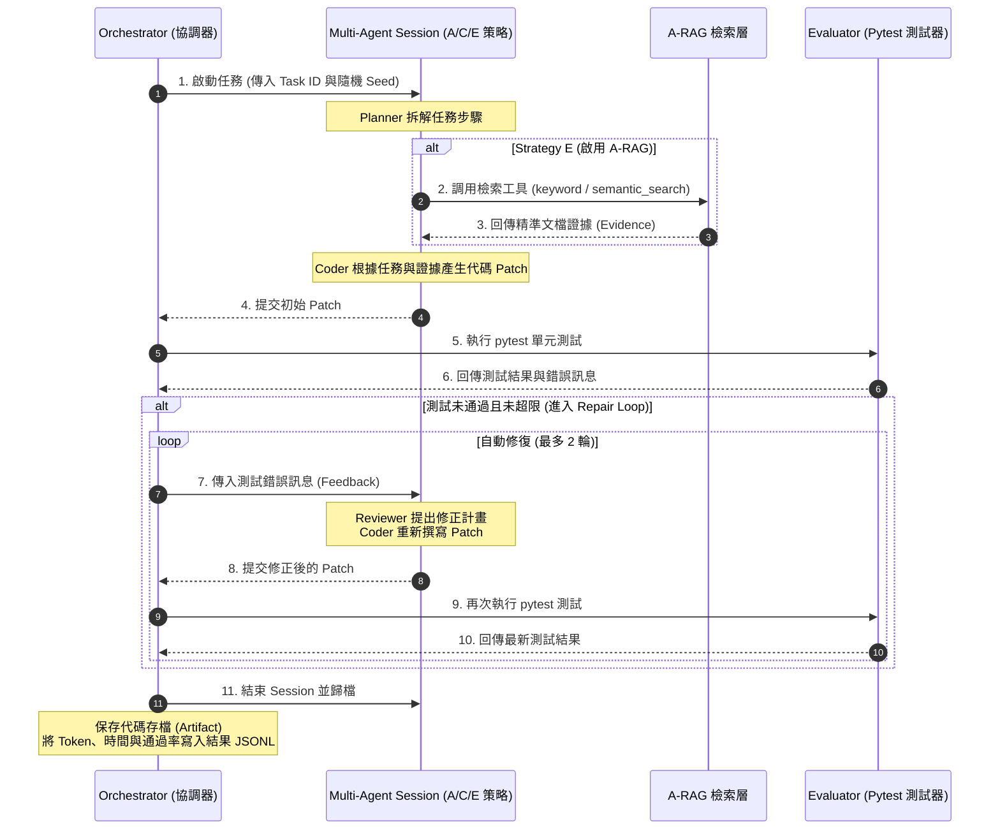

# A-RAG × Autonomous AI Agents 整合實驗：專案架構與設計規範

本文件詳細整理了本專案的**系統架構設計**、**核心運作流程（含 Mermaid 流程圖）**、**五道 Coding 評測任務規格**以及**實驗對照組策略**。旨在協助組員快速理解專案細節，並便於直接整理成 PPT 報告投影片。

---

## 一、 專案核心研究目標

本專案旨在探討：**「將 A-RAG（自主階層式檢索）整合至 Planner-Coder-Reviewer 多 Agent 的開發流程中，是否能有效降低大模型在編寫程式時的『函數呼叫幻覺（即調用不存在的函數）』現象，並提升單元測試通過率與需求符合度。」**

*   **傳統開發的痛點**：單一模型在開發時，容易憑空編寫出專案中根本不存在的函數（稱為「幻覺」）。
*   **多 Agent 的盲區**：在沒有檢索文獻支持的情況下，即便有 Reviewer Agent 指出錯誤，Coder Agent 也只能在盲區中不斷盲目猜測函數名稱，最終陷入死循環並耗盡修復預算。
*   **本專案的解決方案**：透過實作一個小型學生資訊管理系統（`student_system`）作為測試基準，量化評估檢索與多 Agent 協同對消除幻覺的成效。

---

## 二、 六篇論文的理論支撐與深度融合邏輯（PPT 報告必備核心）

雖然本專案的實作（實驗）主要圍繞在 **A-RAG** 與 **Multi-Agent 程式碼開發** 兩篇論文，但**本專案的系統設計在理論與架構上得到了全部六篇論文的支持**。組員在報告時，應以下列的「邏輯遞進鏈」說明這六篇論文的關聯：

```text
Transformer (底層大腦) 
   └── GPT-2 (Prompt 多任務能力，支撐 Single LLM 與 Agent 角色扮演)
          └── TinyLlama (邊緣端小模型實踐，記憶有限，更容易有幻覺，因而急需外掛檢索)
                 └── LoRA (參數微調理論，與 A-RAG 構成「靜態微調 + 動態檢索」的優化路徑)
                        └── AutoDev-Agent (流程調度，提供 Planner-Coder-Reviewer 多 Agent 協作)
                               └── A-RAG (檢索技術，提供三層檢索接口，精準獲取函數定義與節省 Token)
```

### 1. 《Attention Is All You Need》 (Transformer 架構)
*   **在本專案的作用**：提供底層計算與語義理解的**大腦骨幹**。
*   **理論關聯**：不管是 Single LLM (Strategy A) 還是多 Agent (C/E) 中的決策引擎，底層全部都是基於 Transformer 的自注意力機制。模型之所以能理解程式碼邏輯、進行多輪糾錯反思，以及 A-RAG 能進行高維度的語義向量檢索 (Semantic Search)，均由此論文奠定基礎。

### 2. 《Language Models are Unsupervised Multitask Learners》 (GPT-2 論文)
*   **在本專案的作用**：支持多 Agent 的**「角色扮演」**與 **Single LLM 基準線**。
*   **理論關聯**：此論文首次證明語言模型僅需透過 Prompt（文字指令）就能執行多種不同任務（Zero-shot 遷移）。這為我們使用不同的 Prompt 來定義 Planner (規劃者)、Coder (開發者)、Reviewer (審查者) 三個不同 Agent 提供了學術依據，也合理化了 Strategy A 作為基準線的可行性。

### 3. 《TinyLlama: An Open-Source Small Language Model》 (邊緣端小模型)
*   **在本專案的作用**：定義了**「本地部署與資源受限」的現實開發場景**。
*   **理論關聯**：本專案的最終目標是讓自動化開發系統能在工程師的本地端運行。TinyLlama 證明了 1.1B 小模型擁有極高推理效率，但小模型內部的記憶（Parametric Knowledge）相對薄弱，比大模型更容易產生「函數呼叫幻覺」。這使得**引入 A-RAG（外掛知識庫）以輔助本地小模型進行開發，在實務上變得更為迫切且關鍵**。

### 4. 《Efficient Fine-tuning of LoRA Techniques》 (高效參數微調)
*   **在本專案的作用**：為系統領域適配提供**「靜態微調與動態檢索的互補路徑」**。
*   **理論關聯**：雖然實驗不直接進行微調，但 LoRA 提供了如何讓模型熟悉特定專案（如 `student_system`）風格的理論支撐。在系統設計上，LoRA 用於在訓練階段讓模型學習專案的「靜態語法風格與基本學則」（Attention 層給予高 Rank，FFN 給予低 Rank）；而 A-RAG 則在運行階段負責「實時檢索動態更新的 API 數據與 Bug 報告」，兩者互補構成完整的領域適配架構。

### 5. 《Designing Autonomous AI Agents for Code Work》 (AutoDev-Agent)
*   **在本專案的作用**：提供多 Agent 的**「工作流與自動修復 (Repair Loop) 流程」**。
*   **理論關聯**：直接指引了本專案的 **Multi-Agent 運作流程**（Strategy C/E）。透過 Planner、Coder、Reviewer 三個角色的流水線分工，模擬真實軟體團隊的 Agile Sprint 開發與 Code Review 流程，並實現了在 pytest 測試失敗時的自動修正（Repair Loop）。

### 6. 《A-RAG: Scaling Agentic Retrieval-Augmented Generation》 (A-RAG)
*   **在本專案的作用**：提供多 Agent **「動態知識獲取工具與 Token 成本優化」**。
*   **理論關聯**：直接支持了本專案的 **檢索模組**（Strategy E）。A-RAG 賦予 Agent 使用 `keyword_search`、`semantic_search` 和 `chunk_read` 的能力，讓 Agent 在寫代碼時自主調用這些工具來查閱 API 規格，保證寫出的代碼是正確的，同時避免一次性塞入過多 Context 造成的 Token 浪費。

---

## 三、 系統架構設計

系統採用分層架構，將多 Agent 協同調度與階層式檢索進行了深度整合：

```mermaid
graph TD
    subgraph 任務輸入 (Input)
        Task[Coding Task: JSON 規格定義]
    end

    subgraph 協同調度層 (Multi-Agent Layer)
        Planner[Planner Agent: 拆解需求與檢索規劃]
        Coder[Coder Agent: 根據計畫與證據編寫 Patch]
        Reviewer[Reviewer Agent: 靜態審查與錯誤反饋]
    end

    subgraph 知識檢索層 (A-RAG Layer)
        ARAG[A-RAG Facade]
        KW[keyword_search: 精確符號匹配]
        SEM[semantic_search: 語意脈絡搜尋]
        CR[chunk_read: 完整段落精讀]
    end

    subgraph 程式庫基礎 (Codebase & Corpus)
        Corpus[(Project Corpus: 函數說明書 / 程式碼規範 / Bug 日誌 / 既有代碼)]
    end

    Task --> Planner
    Planner --> ARAG
    ARAG --> KW
    ARAG --> SEM
    ARAG --> CR
    KW --> Corpus
    SEM --> Corpus
    CR --> Corpus
    ARAG -- 提供檢索證據 (Evidence) --> Coder
    Coder --> Reviewer
```

### 🛠️ 模組細節說明（PPT 製作素材）：
1.  **A-RAG 檢索層（自主檢索）**：不預先將大量文檔硬塞給模型，而是提供三種精細工具供 Agent 自主查閱：
    *   `keyword_search`：精確匹配特定函數或變數名稱。
    *   `semantic_search`：當輸入模糊需求時（如「計算平均成績」），尋找語意相近的代碼或文件。
    *   `chunk_read`：精讀特定檔案的代碼段落，避免 Token 浪費，並幫助模型了解現有程式碼的縮排與結構。
2.  **多 Agent 角色分工**：
    *   **Planner Agent**：負責理解 User Story，規劃修改步驟，決定需要用 A-RAG 查詢哪些檔案。
    *   **Coder Agent**：根據 Planner 的規劃與檢索到的文檔證據（Evidence）編寫修改代碼（產生 Patch 檔）。
    *   **Reviewer Agent**：負責執行靜態分析、檢查編程風格，並在測試失敗時提供具體的錯誤報告。

---

## 四、 專案核心工作流程

Orchestrator（實驗協調器）驅動的單次解題與自動修復流程如下所示：



---

## 五、 評測任務設計 (T01 ~ T05)

本專案在 `student_system` 中設計了 5 道評測題目，用以測試模型在不同限制下是否會產生「函數呼叫幻覺」：

### 📌 【T01】及格率計算 (code_generation)
*   **任務目標**：在 `grade.py` 中新增 `calculate_pass_rate(course_id)`。
*   **設計陷阱**：模型必須查閱函數說明書（`API_SPEC.md`），使用專案內建的 `get_grades_by_course(course_id)` 與 `course.get_course_by_id(course_id)`。若課程不存在須拋出 `ValueError`，若課程目前無人修讀則回傳 `0.0`。
*   **評分標準**：絕對不可自己虛構不存在的函數名稱。
*   **檢索關鍵**：`API_SPEC.md`。

### 📌 【T02】學生修課摘要查詢 (api_usage)
*   **任務目標**：在 `student.py` 中建立 `get_student_course_summary(student_id)`。
*   **設計陷阱**：禁止直接存取底層原始資料庫字典（如 `raw_grades`）。模型必須學會正確串接與調用 `grade.get_grades_by_student` 與 `course.get_course_by_id` 兩個既有函數，考驗模型是否會產生呼叫幻覺。
*   **檢索關鍵**：`API_SPEC.md`、`course.py`、`grade.py`。

### 📌 【T03】GPA 映射邏輯修正 (bug_fix)
*   **任務目標**：修復 `grade.py` 中 `score_to_gpa(score)` 的映射錯誤。
*   **設計陷阱**：原本的代碼漏掉了分數 85-89 對應 GPA 3.5 的邏輯，且將 70-74 誤設為 GPA 1.5（應為 2.0）。此外，需針對小於 0 或大於 100 的無效分數拋出 `ValueError`。
*   **檢索關鍵**：`ISSUES.md`（內含 Bug 反饋日誌）。

### 📌 【T04】成績有效性邊界與型態修正 (bug_fix)
*   **任務目標**：修復 `utils.py` 中的 `is_valid_score(score)` 判定邏輯。
*   **設計陷阱**：確保邊界值 0 與 100 回傳 `True`。傳入非數值型態（如字串、List、None）或布林值 `True/False` 時應安全回傳 `False`，不可造成程式崩潰。
*   **檢索關鍵**：`ISSUES.md`。

### 📌 【T05】成績驗證邏輯重構 (refactoring)
*   **任務目標**：重構 `student.py` 與 `grade.py` 中重複的成績驗證邏輯。
*   **設計陷阱**：在 `utils.py` 中新增 `validate_score(score)` 函式，並在其他模組中調用以符合 DRY 原則。validate_score 本身不得調用 `is_valid_score`，防止循環依賴。
*   **檢索關鍵**：`STYLE_GUIDE.md`（程式碼編寫規範）。

---

## 六、 實驗策略對照組設計 (Strategies)

| 策略組別 | 運作流程 | 實驗目的與預期問題（PPT 報告重點） |
| :--- | :--- | :--- |
| **Strategy A**<br/>(Single LLM 基準組) | 直接將任務說明交給單一模型生成代碼。 | **基準對照**：無多 Agent 協調，無任何專案脈絡檢索。模型極度容易編寫出「不存在的函數名稱」（發生幻覺）。 |
| **Strategy C**<br/>(Multi-Agent 協作組) | Planner 規劃 ➡️ Coder 寫代碼 ➡️ 測試失敗時自動進入修復循環。 | **盲區修復限制**：雖然有 Agent 協作和自動修復，但因為沒有文檔檢索，Coder 在修改時只能盲目猜測函數名稱，極易在死循環中**耗盡預算而失敗**。 |
| **Strategy E**<br/>(Multi-Agent + A-RAG) | Planner 規劃 ➡️ **A-RAG 檢索文檔取得證據** ➡️ Coder 編寫代碼 ➡️ 自動修復。 | **完整整合方案**：多 Agent 配合 A-RAG 檢索，可精準獲取函數定義與規範。預期能大幅降低幻覺並提升測試通過率。 |

---

## 七、 評估指標與工程痛點

### 📈 評估指標
1.  **Pass@1**：初始產生的 Patch 直接通過單元測試的比例。
2.  **Final Pass**：經過最多 2 輪自動修復後，最終通過單元測試的比例。
3.  **函數使用正確率 (API Correctness)**：模型是否正確調用了專案現有的函數，無幻覺虛構。
4.  **函數幻覺率 (Hallucinated API Rate)**：模型在代碼中調用不存在函數的頻率。
5.  **Token 消耗量**與**執行延遲 (Latency)**：評估多 Agent 帶來的運算成本。

### ⚠️ 真實工程痛點（PPT 報告加分項）
在實際執行實驗時，組員可以重點討論以下兩個核心挑戰：
1.  **盲目糾錯預算耗盡 (Blind Repair Bottleneck)**：
    無檢索的多 Agent 策略 (Strategy C) 因為拿不到 `API_SPEC.md`，在寫錯函數名時，Reviewer 與 pytest 只能提供「報錯」，模型在缺乏外部指引下只能盲目重試，最後常因為達到 `repair_limit` 失敗。
2.  **Patch 合併套用失敗 (Patch Apply Failures)**：
    模型生成的代碼修改片段 (Patch) 通常以 diff 格式呈現。如果模型數錯了代碼行號，或者縮排與原檔案有極微小出入，即使邏輯完全正確，自動化工具也無法將代碼合併寫入檔案。這證明了**自動化開發系統不僅考驗模型的語義理解，也非常依賴後續代碼合併工具的健壯度**。
